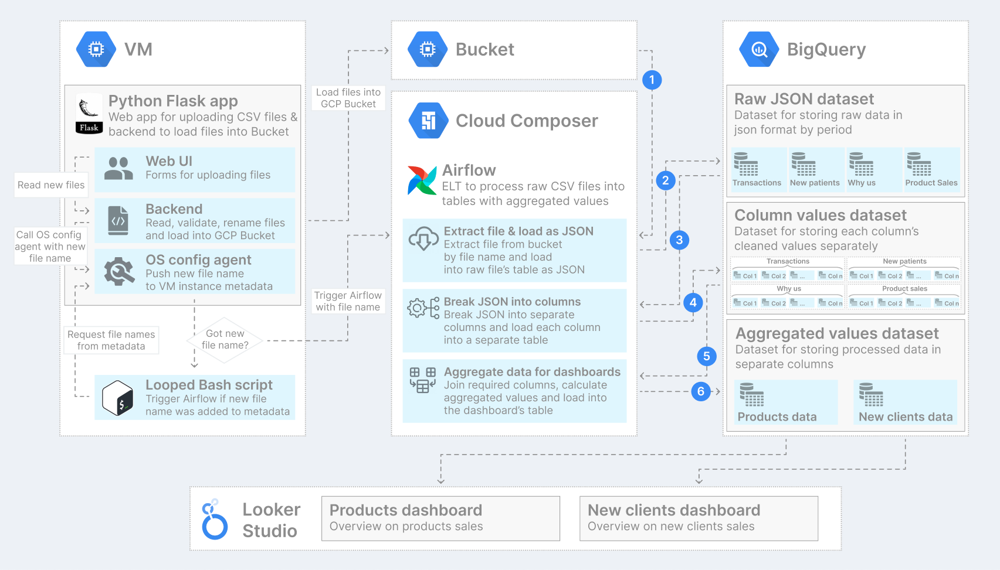

# Healthcare Data ETL

### build client-app docker: 
PORT 3000
docker build -t upload_ui/main .
docker container run -d -p 3000:3000 upload_ui/main

### build airflow docker: 
PORT 8080

### build postgres: 
PORT 5432

<a href="https://raw.githubusercontent.com/steven-kollo/healthcare-data-etl/main/scheme.png">Open architecture scheme in good quality</a>

